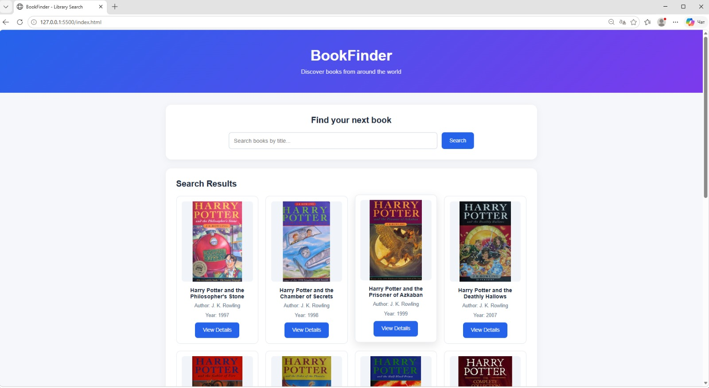

# BookFinder — Lab 6

Web Programming | IT1-2310

Student: Zhumabay Nurahmet

## Project Description

BookFinder is a web application for searching books
using a public REST API.

Built with HTML, CSS, and vanilla JavaScript.

## API

API: Open Library

Base URL: https://openlibrary.org

Search endpoint: /search.json?q=python

Book details endpoint: /works/{id}.json

No API key is required.

## Features

- Search books using fetch and async/await
- Display book cards with titles, authors and covers
- Show loading and error states
- Handle HTTP errors using response.ok
- Use try/catch for error handling
- View book details with a second API request
- Load two collections in parallel using Promise.all
- Responsive design

## Async/Await Explanation

The async keyword allows a function to use await.
The await keyword pauses the execution of an async
function until a Promise settles.
Fetch returns a Promise containing the HTTP response.
We check response.ok because fetch does not automatically
reject when the server returns HTTP errors such as 404.
If response.ok is false, we throw an error that can be
handled using try/catch.

## Technologies

- HTML5
- CSS3
- JavaScript
- Fetch API
- Open Library REST API

## Screenshot

## AI Tools

ChatGPT was used to assist with code development,
debugging, explanations and documentation.

## How to Run

1. Clone the repository.
2. Open the project folder in VS Code.
3. Open index.html using Live Server.
4. Search for books and explore the results.